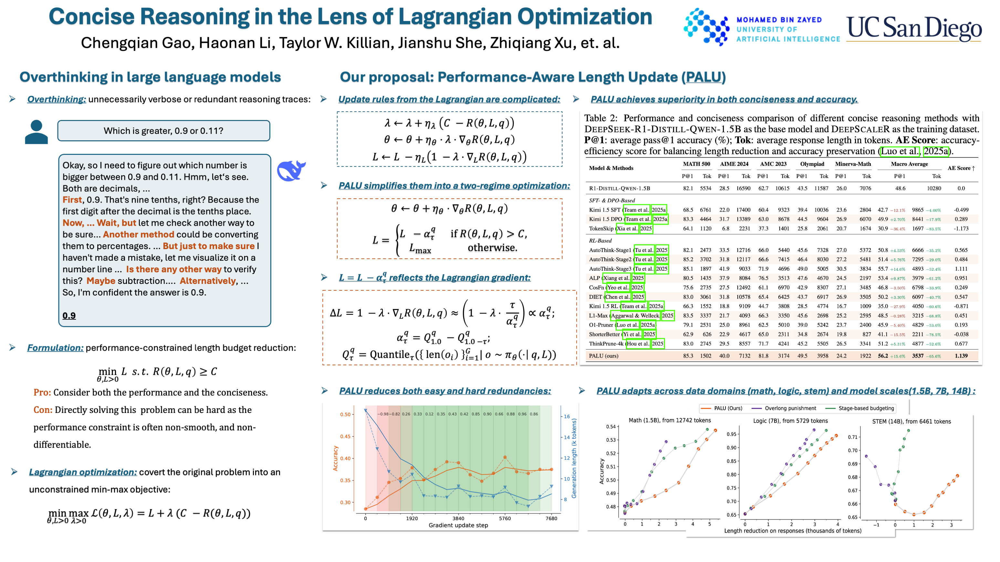

## PALU: Concise Reasoning in the Lens of Lagrangian Optimization

This repository hosts the code, W&B logs, and finetuned models for [our paper](https://arxiv.org/abs/2510.10168). The proposed algorithm, PALU (Performance-Aware Length Update), frames concise reasoning as a performance-constrained length reduction problem, optimizing for the shortest reasoning path that still meets a target accuracy.

 

### 🚀 Key Highlights

- ***65%*** shorter generations while achieving ***+15%*** accuracy improvements across ***five*** benchmark reasoning tasks (AIME24, Math 500, AMC 23, OlympiadBench and Minerva-Math).

- Cross-domain robustness across ***math***, ***logic***, and ***STEM*** tasks.

- Model-scale generalization: consistent performance from ***1.5B***, ***7B***, to ***14B*** parameter models.

- Built on ***Lagrangian optimization principles***, balancing reasoning efficiency and accuracy.

- Evaluated on the DeepSeek-R1-Distill-Qwen model family.

 

### 📦 Resources
| Resource                        | Description                                     | Availability  |
| ------------------------------- | ----------------------------------------------- | ------------- |
| 🧠 **W&B Logs**                 | Full experiment tracking and visualization      | *Coming soon* |
| 🤗 **Hugging Face Checkpoints** | Fine-tuned PALU models                          | *Coming soon* |
| 📄 **Research Paper**           | Detailed methodology, experiments, and analysis | [Arixv](https://arxiv.org/pdf/2510.10168) |

 

### 📜 Poster Overview

For a concise visual summary of PALU and its core contributions, please refer to our project poster below:

